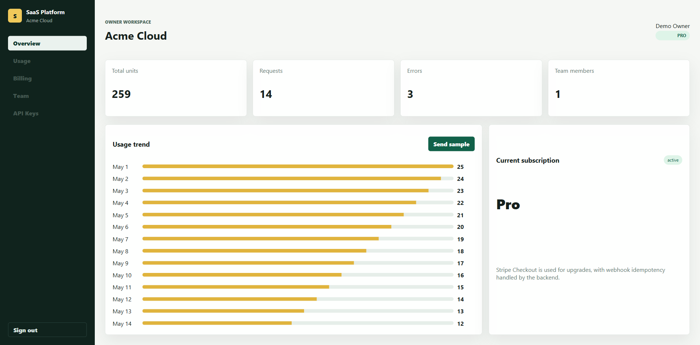
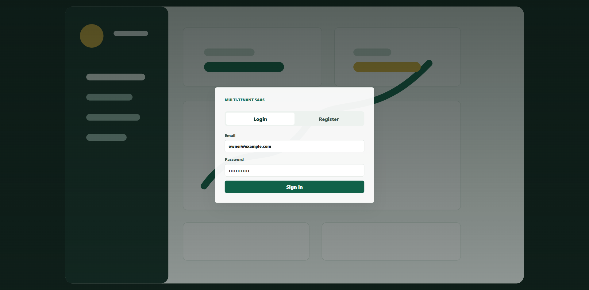
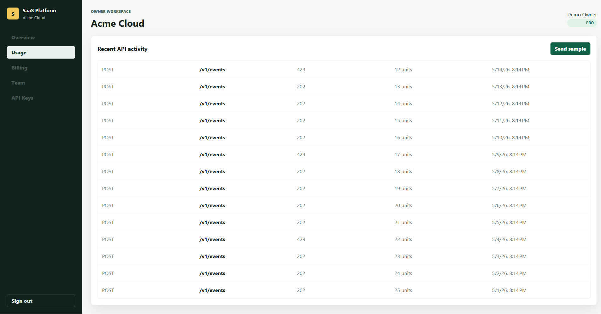
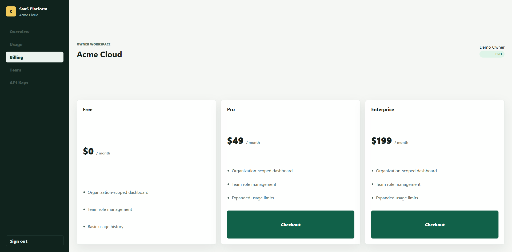
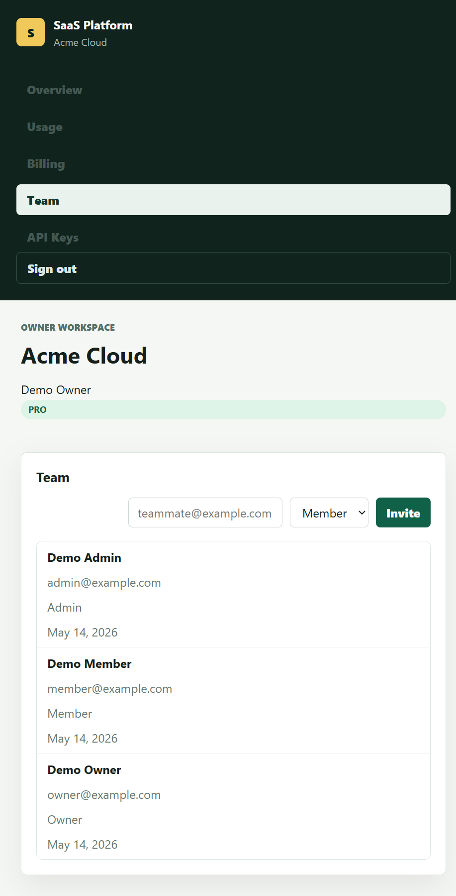
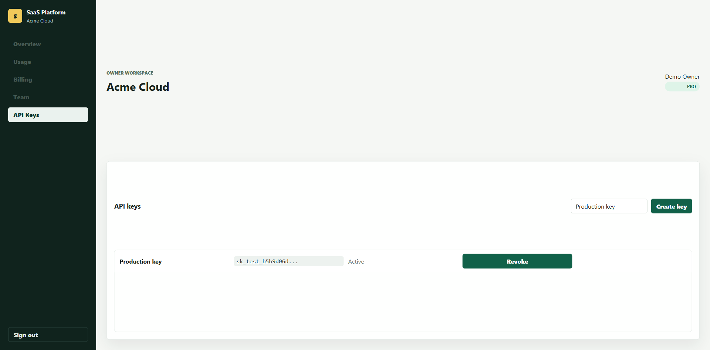

# SaaS Multi-Tenant Platform

A production-ready full-stack SaaS platform starter template built with **Angular** and **ASP.NET Core/C#**. This comprehensive project demonstrates modern cloud-native architecture patterns including multi-tenancy, microservices integration, real-time communication, event-driven design, and enterprise-grade security.

The platform is separated into a responsive frontend application and a scalable backend API with modular endpoint groups, service-oriented architecture, caching layers, asynchronous job processing, message queue integration, real-time WebSocket updates, distributed rate limiting, and comprehensive monitoring capabilities.



## Key Highlights

- **Production-Ready Architecture**: Enterprise-grade patterns for scalability and reliability
- **Multi-Tenant Isolation**: Complete organization-scoped data segregation and access control
- **Real-Time Updates**: WebSocket-powered SignalR hub for live dashboard and usage analytics
- **Event-Driven**: RabbitMQ integration for decoupled, asynchronous workflows
- **Secure**: JWT authentication, API key management with SHA-256 hashing, role-based access control
- **Observable**: Comprehensive logging, monitoring metrics, and request tracing
- **Containerized**: Full Docker Compose stack with all dependencies pre-configured

## Implemented Features

### Authentication & Authorization
- **JWT Authentication**: Secure token-based authentication with configurable signing keys
- **User Registration & Login**: Complete authentication flow with session management
- **Session Restore**: Automatic session recovery from stored JWT tokens
- **Multi-Role RBAC**: Owner, Admin, and Member roles with granular permission checks
- **Privileged Endpoint Guards**: Attribute-based authorization on sensitive operations

### Multi-Tenancy
- **Organization Isolation**: Complete data segregation per tenant with tenant-scoped queries
- **Organization Dashboard APIs**: All endpoints are organization-scoped for multi-tenant safety
- **Dynamic Organization Switching**: Users can operate across multiple organizations
- **Organization-Level Metrics**: Isolated usage, billing, and team data per organization

### Billing & Subscriptions
- **Stripe Integration**: Complete Stripe Checkout and subscription management integration
- **Price ID Support**: Flexible pricing with multiple plan levels (Pro, Enterprise)
- **Webhook Handling**: Idempotent Stripe webhook processing for subscription lifecycle events
- **Subscription State Management**: Track active, canceled, and expired subscriptions
- **Event-Driven Billing**: Async notifications for subscription changes

### API Key Management
- **Secure Key Generation**: Cryptographically secure API key creation
- **SHA-256 Hashing**: Keys stored using industry-standard hashing, never plaintext
- **One-Time Secret Display**: Secret shown only at creation for maximum security
- **Key Revocation**: Instantly disable compromised or unused keys
- **Last-Used Tracking**: Monitor API key activity and detect unused credentials

### Usage Analytics & Tracking
- **Real-Time Ingestion**: High-throughput API usage ingestion with X-API-Key authentication
- **Distributed Caching**: Redis-backed summary caching for query performance
- **Trend Analysis**: Historical usage tracking and trend calculations
- **Activity Timeline**: Detailed event logs with timestamps and method info
- **Real-Time Dashboard Updates**: WebSocket-powered live usage refresh

### Team Management
- **Member Invitations**: Async team invitation jobs with event publishing
- **Role Assignment**: Flexible role management and permission delegation
- **Member Directory**: Complete team member listing with role visibility
- **Invitation Tracking**: Monitor pending and accepted invitations

### Real-Time Communication
- **SignalR WebSocket Hub**: Persistent WebSocket connections at `/hubs/realtime`
- **Organization Groups**: Users subscribe to organization-specific event channels
- **Live Usage Updates**: Real-time cache invalidation and dashboard refresh
- **Event Broadcasting**: Support for multi-user awareness and coordination

### Performance & Scalability
- **Redis Distributed Cache**: High-performance caching for usage summaries and frequently accessed data
- **Background Job Queue**: Channel-backed asynchronous task processing
- **Hosted Background Services**: Long-running worker processes for async workflows
- **Rate Limiting**: ASP.NET Core rate limiting with multiple policies:
  - Dashboard API: 120 requests/minute per IP
  - Ingest API: 60 requests/minute per API key or IP
- **Connection Pooling**: Optimized database connections for PostgreSQL and MongoDB

### Observability & Monitoring
- **Structured Request Logging**: Complete request lifecycle logging (method, path, status, duration)
- **Metrics Endpoint**: `/api/monitoring/metrics` exposes:
  - Application uptime
  - Total request counts
  - Failed request tracking
  - Request distribution by endpoint
- **Health Checks**: `/api/health` endpoint for container orchestration and monitoring systems
- **Request Tracing**: Correlation IDs for distributed tracing support

### Infrastructure & Storage
- **Dual Database Strategy**:
  - **PostgreSQL**: Transactional SaaS data (users, organizations, subscriptions, API keys)
  - **MongoDB**: High-volume event storage (usage events, audit logs)
- **Redis Caching**: Distributed cache for performance optimization
- **RabbitMQ Message Queue**: Async event publishing and consumption
- **Docker Containerization**: Production-ready Docker images for all services
- **Docker Compose**: One-command full-stack setup for local and staging environments

## Screenshots

### Authentication



### Overview


### Usage Analytics



### Billing



### Team Management



### API Keys



## Tech Stack

### Frontend

Modern Angular-based single-page application with responsive design:

- **Angular 19+**: Latest stable Angular framework with standalone components
- **TypeScript**: Fully typed for enhanced IDE support and code safety
- **Angular Router**: Client-side routing for multi-page navigation
- **Angular Reactive Forms**: Dynamic form handling with validation
- **Angular HttpClient**: Type-safe HTTP communication with interceptors
- **Angular Signals**: Fine-grained reactivity for state management
- **Microsoft SignalR**: Real-time WebSocket client for live updates
- **CSS3**: Modern styling with responsive design patterns

### Backend

Enterprise-grade ASP.NET Core with microservices-ready architecture:

- **ASP.NET Core 10 Web API**: Latest framework for high-performance APIs
- **C# 13**: Modern language features for clean, maintainable code
- **Minimal API Endpoints**: Lightweight HTTP routing with organized endpoint groups
- **JWT Tokens**: Stateless authentication with claims-based authorization
- **SignalR**: Real-time bidirectional communication
- **IDistributedCache**: Abstraction for Redis distributed caching
- **Entity Framework Core**: Type-safe ORM with LINQ queries
- **Npgsql**: Native PostgreSQL data provider
- **RabbitMQ .NET Client**: Async message publishing and consumption
- **Hosted Services**: Background worker patterns with lifetime management
- **Rate Limiting**: Built-in middleware for API throttling
- **PBKDF2**: Password hashing with configurable iterations
- **SHA-256**: Cryptographic hashing for API keys and sensitive data

### Infrastructure & Services

Cloud-native services for production workloads:

- **Docker**: Container runtime for consistent deployments
- **Docker Compose**: Multi-container orchestration for local/staging
- **PostgreSQL 15+**: ACID-compliant relational database for core data
- **MongoDB 6+**: Document database for event and audit storage
- **Redis 7+**: In-memory data store for caching and sessions
- **Prisma**: Schema tooling and migration management
- **RabbitMQ 3.12+**: Message broker with management UI
- **Stripe**: Payment processing and subscription management

### Development Tools

- **dotnet CLI**: Build and run .NET applications
- **npm**: JavaScript package manager
- **Git**: Version control
- **Visual Studio Code**: Recommended IDE with C# and Angular extensions
- **Docker Desktop**: Local container runtime

## Architecture Patterns

## Architecture Patterns

### Multi-Tenant Isolation

Every API request validates and sets the current organization context. All database queries are automatically scoped to the current tenant:

```csharp
// Tenant context flows through the request pipeline
var organizationId = CurrentUser.OrganizationId; // Verified from JWT claims
var data = await dbContext.Users
    .Where(u => u.OrganizationId == organizationId)
    .ToListAsync();
```

### Event-Driven Architecture

Asynchronous workflows decouple features and enable scalability:

- **Publishing**: Business operations publish events to RabbitMQ
- **Consumption**: Consumer services process events independently
- **Broadcasting**: SignalR pushes real-time updates to connected clients

### Service Layer Pattern

Separation of concerns keeps endpoints lightweight:

- **Endpoints**: HTTP contracts and validation
- **Services**: Business logic and orchestration
- **Persistence**: Data access and aggregation
- **Infrastructure**: External service integration

### Dependency Injection

Constructor injection provides loose coupling and testability:

```csharp
public class ApiKeyService
{
    private readonly PlatformStore _store;
    private readonly IEventBus _eventBus;
    
    public ApiKeyService(PlatformStore store, IEventBus eventBus)
    {
        _store = store;
        _eventBus = eventBus;
    }
}
```

## Project Structure

```text
.
|-- backend/
|   |-- Contracts/
|   |   |-- Requests.cs
|   |   `-- Responses.cs
|   |-- Domain/
|   |   `-- Entities.cs
|   |-- Endpoints/
|   |   |-- ApiKeyEndpoints.cs
|   |   |-- AuthEndpoints.cs
|   |   |-- BillingEndpoints.cs
|   |   |-- HealthEndpoints.cs
|   |   |-- OrganizationEndpoints.cs
|   |   |-- TeamEndpoints.cs
|   |   `-- UsageEndpoints.cs
|   |-- Infrastructure/
|   |   |-- Caching/
|   |   |   `-- CacheKeys.cs
|   |   |-- Jobs/
|   |   |   |-- BackgroundJobQueue.cs
|   |   |   |-- IBackgroundJobQueue.cs
|   |   |   `-- QueuedHostedService.cs
|   |   |-- Messaging/
|   |   |   |-- IEventBus.cs
|   |   |   |-- PlatformEvent.cs
|   |   |   |-- RabbitMqConsumerService.cs
|   |   |   |-- RabbitMqEventBus.cs
|   |   |   `-- RabbitMqOptions.cs
|   |   `-- Monitoring/
|   |       |-- AppMetrics.cs
|   |       `-- RequestLoggingMiddleware.cs
|   |-- Persistence/
|   |   |-- PlatformStore.cs
|   |   `-- SeedData.cs
|   |-- Realtime/
|   |   `-- RealtimeHub.cs
|   |-- Security/
|   |   |-- CurrentUser.cs
|   |   |-- PasswordHasher.cs
|   |   `-- TokenService.cs
|   |-- Services/
|   |   |-- ApiKeyService.cs
|   |   |-- BillingService.cs
|   |   `-- StripeWebhookService.cs
|   |-- Dockerfile
|   |-- Program.cs
|   |-- SaaS.Api.csproj
|   `-- appsettings.json
|-- frontend/
|   |-- public/
|   |   `-- dashboard-bg.svg
|   |-- src/
|   |   |-- app/
|   |   |   |-- core/
|   |   |   |   |-- api-client.service.ts
|   |   |   |   |-- dashboard.store.ts
|   |   |   |   |-- models.ts
|   |   |   |   |-- realtime.service.ts
|   |   |   |   `-- session.store.ts
|   |   |   |-- features/
|   |   |   |   |-- api-keys/
|   |   |   |   |-- auth/
|   |   |   |   |-- billing/
|   |   |   |   |-- dashboard/
|   |   |   |   |-- overview/
|   |   |   |   |-- team/
|   |   |   |   `-- usage/
|   |   |   |-- app.config.ts
|   |   |   |-- app.routes.ts
|   |   |   |-- app.ts
|   |   |   `-- app.html
|   |   |-- index.html
|   |   |-- main.ts
|   |   `-- styles.css
|   |-- Dockerfile
|   |-- angular.json
|   |-- package-lock.json
|   `-- package.json
|-- database/
|   |-- package.json
|   `-- prisma/
|       `-- schema.prisma
|-- docs/
|   `-- screenshots/
|-- .env.example
|-- docker-compose.yml
|-- README.md
`-- SaaSMultiTenantPlatform.slnx
```

## Backend Architecture

### Composition Root (Program.cs)

The composition root configures all services and middleware in a single, testable location:

```csharp
// Service registration
builder.Services.AddScoped<PlatformStore>();
builder.Services.AddSingleton<IDistributedCache>(new MemoryDistributedCache());
builder.Services.AddSingleton<IEventBus, RabbitMqEventBus>();

// Middleware pipeline
app.UseMiddleware<RequestLoggingMiddleware>();
app.UseRateLimiter();
app.MapGroup("/api").WithTags("API");

// Endpoint mapping
app.MapGroup("/api/auth").WithTags("Auth").MapAuthEndpoints();
app.MapGroup("/api/organizations").WithTags("Organizations").MapOrganizationEndpoints();
```

### Endpoint Groups Organization

Minimal API endpoints are organized into logical groups for maintainability and discoverability:

#### AuthEndpoints
- `POST /api/auth/register` → `CreateUserAndOrganization`
- `POST /api/auth/login` → `AuthenticateUser`
- `GET /api/auth/me` → `RestoreSession`

Handles user lifecycle and JWT token management with secure session recovery.

#### OrganizationEndpoints
- `GET /api/organizations/list` → `ListUserOrganizations`
- `POST /api/organizations` → `CreateOrganization`
- `GET /api/organizations/current` → `GetCurrentOrganization`

Multi-tenant context management and organization creation with tenant isolation.

#### TeamEndpoints
- `GET /api/users` → `ListOrganizationMembers`
- `POST /api/users/invite` → `InviteTeamMember`

Team collaboration with async invitation processing and role assignment.

#### BillingEndpoints
- `GET /api/billing/subscription` → `GetSubscriptionStatus`
- `POST /api/billing/checkout` → `CreateCheckoutSession`
- `POST /api/billing/webhook` → `HandleStripeWebhook`

Stripe integration with idempotent webhook handling and subscription lifecycle management.

#### ApiKeyEndpoints
- `GET /api/api-keys` → `ListApiKeys`
- `POST /api/api-keys` → `GenerateApiKey`
- `DELETE /api/api-keys/{id}` → `RevokeApiKey`

Secure API key lifecycle with one-time secret display and usage tracking.

#### UsageEndpoints
- `GET /api/usage` → `GetUsageSummary`
- `POST /api/usage/ingest` → `IngestUsageEvent`

High-performance usage aggregation with cache invalidation and real-time broadcasting.

#### HealthEndpoints
- `GET /api/health` → `HealthCheck`
- `GET /api/monitoring/metrics` → `GetMetrics`

Application health and operational metrics for monitoring and orchestration.

### Infrastructure Organization

#### Caching (`Infrastructure/Caching/`)
- `CacheKeys.cs`: Centralized cache key conventions for consistency

Enables cache key management across the application with organized naming patterns.

#### Jobs (`Infrastructure/Jobs/`)
- `IBackgroundJobQueue.cs`: Queue abstraction for decoupling
- `BackgroundJobQueue.cs`: Channel-based implementation for in-process queuing
- `QueuedHostedService.cs`: Hosted worker that processes queued jobs

Background job processing for long-running operations like team invitations.

#### Messaging (`Infrastructure/Messaging/`)
- `IEventBus.cs`: Publisher abstraction
- `PlatformEvent.cs`: Base event model
- `RabbitMqEventBus.cs`: RabbitMQ-based publishing
- `RabbitMqConsumerService.cs`: Event consumption and processing
- `RabbitMqOptions.cs`: Configuration binding

Event-driven architecture enabling decoupled async workflows.

#### Monitoring (`Infrastructure/Monitoring/`)
- `RequestLoggingMiddleware.cs`: Comprehensive request lifecycle logging
- `AppMetrics.cs`: In-process metrics collection

Observability and performance tracking for every request.

#### Persistence (`Persistence/`)
- `PlatformStore.cs`: In-memory demo store for local development
- `SeedData.cs`: Initial data for demo accounts

**PostgreSQL** (`Persistence/Postgres/`)
- `PlatformDbContext.cs`: EF Core DbContext with tenant-scoped queries
- `PostgresProjectionService.cs`: Syncs in-memory store to PostgreSQL

**MongoDB** (`Persistence/Mongo/`)
- `MongoUsageService.cs`: Event document storage
- `UsageDocument.cs`: Document model
- `MongoOptions.cs`: Connection configuration

### Database Strategy

**PostgreSQL** stores transactional SaaS data with ACID guarantees:
- Users and authentication
- Organizations and multi-tenancy
- Team memberships and roles
- Subscriptions and billing state
- API keys and credentials
- Webhook event IDs for deduplication

**MongoDB** stores high-volume event data:
- Usage event documents (timestamps, methods, status codes)
- Audit trail documents (user actions, changes)
- Enables fast ingestion without relational constraints
- Supports TTL indexes for automatic cleanup

### Realtime (`Realtime/`)
- `RealtimeHub.cs`: SignalR hub at `/hubs/realtime`

Provides WebSocket connection management and organization-scoped event broadcasting for live dashboard updates.

### Security (`Security/`)
- `CurrentUser.cs`: Claims principal extraction with organization context
- `PasswordHasher.cs`: PBKDF2-based password hashing with salt
- `TokenService.cs`: JWT token generation and validation

Implements enterprise-grade authentication and authorization patterns.

## Frontend Architecture

### State Management

Angular Signals provide reactive state management with fine-grained reactivity:

#### SessionStore
Manages authentication state and JWT tokens:
- Current user information
- JWT token storage and expiration
- HTTP authorization headers
- Login/logout state transitions

#### DashboardStore
Centralized dashboard data and actions:
- Organization context
- Current user and their role
- Team members and permissions
- Cache invalidation signals
- User action dispatchers

#### Models
Strongly-typed data contracts:
- User, Organization, Team models
- API request/response types
- Role and permission enums

### Core Services

#### ApiClient
Type-safe HTTP client with centralized configuration:

```typescript
export class ApiClient {
  getOrganizations(): Observable<Organization[]> {
    return this.http.get<Organization[]>('/api/organizations/list');
  }
  
  createApiKey(): Observable<{ id: string; secret: string }> {
    return this.http.post('/api/api-keys', {});
  }
}
```

Features:
- Request/response interceptors
- Error handling and user feedback
- Base URL configuration from environment
- Automatic authorization headers from SessionStore

#### RealtimeService
SignalR connection management with auto-reconnection:

```typescript
export class RealtimeService {
  connect(): Observable<HubConnection>
  joinOrganization(orgId: string): void
  onUsageUpdated(): Observable<UsageSummary>
  disconnect(): void
}
```

Features:
- Automatic connection recovery
- Organization group subscription
- Event binding with typed signals
- Graceful disconnection handling

### Component Structure

#### Authentication (`features/auth/`)
- Registration and login forms
- Reactive form validation
- Password strength indicators
- Session persistence

#### Dashboard (`features/dashboard/`)
- Main layout with navigation
- Organization switcher
- User profile menu
- Responsive sidebar

#### Overview (`features/overview/`)
- Organization statistics
- Quick action cards
- Recent activity feed
- Health status

#### Usage (`features/usage/`)
- Real-time usage chart
- Trend analysis and forecasts
- Usage by endpoint breakdown
- Export functionality

#### Billing (`features/billing/`)
- Current subscription display
- Plan selection and upgrade flow
- Stripe Checkout integration
- Billing history and invoices

#### Team (`features/team/`)
- Member directory
- Invite new members form
- Role management UI
- Pending invitations list

#### API Keys (`features/api-keys/`)
- Key listing with last-used timestamps
- Key generation with secret display
- Copy-to-clipboard functionality
- Revocation with confirmation

### Responsive Design

- **Mobile-first approach**: Optimized for all screen sizes
- **CSS Grid & Flexbox**: Modern layout techniques
- **Touch-friendly interactions**: Appropriately sized touch targets
- **Progressive enhancement**: Works without JavaScript
- **Dark mode support**: System preference detection ready

### Build Configuration

`angular.json` defines:
- Development server configuration
- Production build optimization
- Source map settings
- Asset inclusion patterns

`tsconfig.json` specifies:
- TypeScript compiler options
- Module resolution
- Strict null checks enabled
- Path aliases for imports

## Local Setup

### Prerequisites

Ensure you have the following tools installed:

- **.NET SDK 10+**: Download from [dotnet.microsoft.com](https://dotnet.microsoft.com/download)
- **Node.js 22+**: Download from [nodejs.org](https://nodejs.org)
- **npm**: Included with Node.js
- **Docker Desktop**: [docker.com](https://www.docker.com/products/docker-desktop) (optional, for containerized database stack)
- **Stripe Account**: [stripe.com](https://stripe.com) (optional, for real billing integration)
- **Git**: For cloning the repository

### Clone

```bash
git clone https://github.com/brianmahlatini/SaaS-Multi-Tenant-Platform.git
cd SaaS-Multi-Tenant-Platform
```

### Configure Environment

Copy `.env.example` if you want environment-variable configuration:

```bash
cp .env.example .env
```

Important values:

```text
Jwt__SigningKey=replace-with-a-long-random-value-at-least-32-chars
Cors__Origins__0=http://localhost:4200
ConnectionStrings__Redis=localhost:6379
RabbitMQ__Enabled=true
RabbitMQ__HostName=localhost
RabbitMQ__Port=5672
RabbitMQ__UserName=guest
RabbitMQ__Password=guest
RabbitMQ__QueueName=saas-platform-events
Stripe__ApiKey=sk_test_replace_me
Stripe__WebhookSecret=whsec_replace_me
Stripe__ProPriceId=price_pro_replace_me
Stripe__EnterprisePriceId=price_enterprise_replace_me
```

The backend falls back to the in-memory demo store when no PostgreSQL connection string is configured, and it falls back to in-memory distributed cache when no Redis connection string is configured. MongoDB writes are skipped when no MongoDB connection string is configured. RabbitMQ is disabled by default in `appsettings.json` and enabled in Docker Compose.

### Install Dependencies

Backend:

```bash
dotnet restore backend/SaaS.Api.csproj
```

Frontend:

```bash
cd frontend
npm install
cd ..
```

### Run Locally Without Docker

Start the backend:

```bash
dotnet run --project backend/SaaS.Api.csproj --launch-profile http
```

Start the frontend:

```bash
cd frontend
npm start
```

Open:

```text
Frontend: http://localhost:4200
Backend health: http://localhost:5000/api/health
Monitoring metrics: http://localhost:5000/api/monitoring/metrics
SignalR hub: http://localhost:5000/hubs/realtime
OpenAPI JSON: http://localhost:5000/openapi/v1.json
```

## Docker

Run the full stack:

```bash
docker compose up --build
```

Services:

```text
Frontend: http://localhost:4200
Backend: http://localhost:5000
PostgreSQL: localhost:5432
MongoDB: localhost:27017
Redis: localhost:6379
RabbitMQ: localhost:5672
RabbitMQ Management UI: http://localhost:15672
RabbitMQ login: guest / guest
PostgreSQL login: saas / saas_password
```

Stop services:

```bash
docker compose down
```

## Demo Accounts

```text
Owner
Email: owner@example.com
Password: ChangeMe123!
Access: Full workspace access, billing, team, API keys, usage

Admin
Email: admin@example.com
Password: ChangeMe123!
Access: Full operational access for team, API keys, usage, and billing actions

Member
Email: member@example.com
Password: ChangeMe123!
Access: Read/monitor workspace data; restricted from owner/admin actions

Organization: Acme Cloud
Plan: Pro
```

## API Endpoints

### Authentication

| Method | Endpoint | Description |
|---|---|---|
| POST | `/api/auth/register` | Create a user and first organization |
| POST | `/api/auth/login` | Issue JWT token |
| GET | `/api/auth/me` | Restore current authenticated session |

### Organizations

| Method | Endpoint | Description |
|---|---|---|
| GET | `/api/organizations/list` | List user organizations |
| POST | `/api/organizations` | Create a new organization |
| GET | `/api/organizations/current` | Get active organization |

### Team

| Method | Endpoint | Description |
|---|---|---|
| GET | `/api/users` | List organization members |
| POST | `/api/users/invite` | Queue teammate invitation job and publish event |

### Billing

| Method | Endpoint | Description |
|---|---|---|
| GET | `/api/billing/subscription` | Get current subscription |
| POST | `/api/billing/checkout` | Create Checkout-shaped session |
| POST | `/api/billing/webhook` | Receive Stripe events |

### API Keys

| Method | Endpoint | Description |
|---|---|---|
| GET | `/api/api-keys` | List organization API keys |
| POST | `/api/api-keys` | Generate API key |
| DELETE | `/api/api-keys/{id}` | Revoke API key |

### Usage

| Method | Endpoint | Description |
|---|---|---|
| GET | `/api/usage` | Cached usage totals, trend, and activity |
| POST | `/api/usage/ingest` | Ingest usage using API key, invalidate cache, publish event, and notify SignalR clients |

### Monitoring

| Method | Endpoint | Description |
|---|---|---|
| GET | `/api/health` | API health check |
| GET | `/api/monitoring/metrics` | Uptime, request counts, failed requests, and request counts by path |

## Example Usage Ingestion

Create an API key in the dashboard, copy the one-time secret, then send usage:

```bash
curl -X POST http://localhost:5000/api/usage/ingest \
  -H "Content-Type: application/json" \
  -H "X-API-Key: sk_test_your_key" \
  -d "{\"path\":\"/v1/events\",\"method\":\"POST\",\"statusCode\":202,\"units\":3}"
```

## Infrastructure Details

### Redis Caching

`UsageEndpoints` caches usage summaries with `IDistributedCache`. When usage is ingested, the organization usage cache key is invalidated. If Redis is configured, the cache is distributed. If not, the app uses in-memory distributed cache for local development.

### PostgreSQL

`PlatformDbContext` defines relational tables for the core SaaS model. `PostgresProjectionService` syncs the running store into PostgreSQL and can hydrate the app from PostgreSQL when a database already contains data. This keeps local demo mode simple while providing a real PostgreSQL persistence path.

### MongoDB

`MongoUsageService` writes usage events and audit events as documents. This keeps high-volume event-style data separate from transactional account and billing records.

### Prisma

`database/prisma/schema.prisma` mirrors the PostgreSQL model as a Prisma schema. It is included for schema review, Prisma tooling, and teams that want a Node-based data tooling workflow alongside the ASP.NET backend. The ASP.NET runtime still uses EF Core/Npgsql.

### Background Jobs

`IBackgroundJobQueue` and `QueuedHostedService` provide a lightweight hosted background job system. Team invitations enqueue an async invitation job after the API request stores the invitation.

### RabbitMQ

`RabbitMqEventBus` publishes platform events such as `team.invitation.created` and `usage.ingested`. `RabbitMqConsumerService` consumes from the configured queue and logs processed messages. RabbitMQ is enabled in Docker Compose.

### WebSockets

`RealtimeHub` is a SignalR hub at `/hubs/realtime`. The Angular `RealtimeService` connects after login, joins the organization group, and refreshes usage when `usageUpdated` events arrive.

### API Rate Limiting

The backend defines two policies:

- `dashboard`: 120 requests per minute per remote IP
- `ingest`: 60 requests per minute per API key or remote IP

### Logging and Monitoring

`RequestLoggingMiddleware` logs method, path, status code, and elapsed time for every request. `AppMetrics` tracks uptime, total requests, failed requests, and request counts by path.

## Development Workflow

### Local Development Without Docker

This is the fastest development experience for iterating on code:

```bash
# Terminal 1: Start the backend
dotnet run --project backend/SaaS.Api.csproj --launch-profile http

# Terminal 2: Start the frontend
cd frontend && npm start

# Terminal 3: (Optional) Start demo background job processing
# The app will continue without this, but background jobs will be queued locally
```

The backend will use:
- In-memory data store (demo mode)
- In-memory distributed cache
- Skipped MongoDB writes
- Local RabbitMQ disabled

### Local Development With Docker

For testing with real database and message queue infrastructure:

```bash
# Start full stack with Docker
docker compose up --build

# In another terminal, run the frontend in dev mode
cd frontend && npm start
```

### Code Organization Best Practices

**Backend Services**: Add new services in the appropriate infrastructure folder:
- Database operations → `Persistence/`
- Background jobs → `Infrastructure/Jobs/`
- Event publishing → `Infrastructure/Messaging/`
- Cache management → `Infrastructure/Caching/`
- Security operations → `Security/`

**Frontend Components**: Follow the feature module structure:
- Route components in `features/[feature-name]/`
- Core services in `core/`
- Shared models in `core/models.ts`
- API calls through `core/api-client.service.ts`

**API Endpoints**: Group related operations in endpoint files:
- Use endpoint groups pattern in `Endpoints/`
- Keep domain logic in services, endpoints as HTTP boundaries
- Always check organization context for tenant isolation

## Troubleshooting

### Backend Won't Start

**Problem**: `dotnet run` fails with connection errors

**Solution**:
- Check .NET SDK version: `dotnet --version` (should be 10.0 or higher)
- Clear cache: `dotnet clean backend/SaaS.Api.csproj`
- Restore packages: `dotnet restore backend/SaaS.Api.csproj`
- Check for port conflicts on 5000: `netstat -ano | findstr :5000` (Windows) or `lsof -i :5000` (Mac/Linux)

### Frontend Build Errors

**Problem**: `npm start` fails with module not found

**Solution**:
- Clear node modules: `cd frontend && rm -rf node_modules && npm install`
- Check Node version: `node --version` (should be 22.0 or higher)
- Clear npm cache: `npm cache clean --force`

### Docker Compose Issues

**Problem**: Services won't start or containers exit immediately

**Solution**:
```bash
# Clean up previous containers
docker compose down -v

# Rebuild from scratch
docker compose build --no-cache

# Start with logs for debugging
docker compose up -d
docker compose logs -f
```

### Database Connection Errors

**Problem**: "Cannot connect to PostgreSQL/MongoDB"

**Solution**:
- Verify Docker container is running: `docker ps`
- Check credentials in `.env` or `docker-compose.yml`
- Ensure ports are not already in use:
  - PostgreSQL: 5432
  - MongoDB: 27017
  - Redis: 6379
  - RabbitMQ: 5672 (AMQP), 15672 (Management UI)

### Real-Time Updates Not Working

**Problem**: Usage updates don't appear in real-time dashboard

**Solution**:
- Verify SignalR connection: Check browser DevTools → Network → WS
- Ensure WebSocket is not blocked by firewall
- Check browser console for connection errors
- Verify RabbitMQ is running if using RabbitMQ events
- Check Redis connection if using distributed cache

### Stripe Webhook Failures

**Problem**: Webhook events not being processed

**Solution**:
- Verify Stripe API key and webhook secret in `.env`
- Use Stripe CLI for local testing: `stripe listen --forward-to localhost:5000/api/billing/webhook`
- Check application logs for webhook processing errors
- Ensure webhook event version matches expected schema

## Deployment

### Prerequisites for Production

1. **Environment Configuration**: Set production environment variables
   - Generate new JWT signing key (min 32 characters)
   - Configure Stripe API keys and webhook secret
   - Set CORS origins to production domain
   - Use strong Redis password

2. **Database Setup**:
   ```bash
   # Run migrations
   dotnet ef database update --project backend/SaaS.Api.csproj
   ```

3. **Security Checklist**:
   - [ ] JWT signing key randomized and secured
   - [ ] Database credentials stored in secrets manager
   - [ ] API keys never committed to version control
   - [ ] CORS origins restricted to production domains
   - [ ] HTTPS enforced
   - [ ] Rate limiting policies reviewed for production traffic

### Docker Production Build

```bash
# Build optimized images
docker compose -f docker-compose.yml build --no-cache

# Push to registry (example)
docker tag saas-platform-backend:latest myregistry/backend:latest
docker push myregistry/backend:latest
```

### Kubernetes Deployment (Optional)

For production Kubernetes deployments:
- Use Helm charts for configuration management
- Set resource limits appropriately
- Configure health checks from exposed endpoints
- Use separate namespace for isolation
- Enable pod autoscaling based on CPU/memory metrics

## Contributing

### Pull Request Process

1. Fork the repository
2. Create a feature branch: `git checkout -b feature/amazing-feature`
3. Commit changes: `git commit -m 'Add amazing feature'`
4. Push to branch: `git push origin feature/amazing-feature`
5. Open a Pull Request with detailed description

### Code Standards

**Backend C#**:
- Use PascalCase for class and method names
- Use camelCase for local variables
- Add XML documentation comments for public APIs
- Keep methods focused and under 20 lines when possible
- Use dependency injection for testability

**Frontend TypeScript**:
- Use Angular style guide conventions
- Implement OnDestroy for subscription cleanup
- Use reactive forms for complex forms
- Keep components under 300 lines
- Extract business logic to services

## Performance Optimization

### Caching Strategy

- **Usage Summaries**: Cached in Redis, invalidated on new ingestion
- **Organization Data**: Short TTL cache for frequently accessed data
- **API Responses**: Browser caching headers set appropriately

### Query Optimization

- PostgreSQL indexes on `organization_id` and `user_id`
- MongoDB TTL indexes for automatic event cleanup
- API key lookups indexed for fast validation

### Scaling Considerations

**Horizontal Scaling**:
- Stateless backend design supports multiple instances
- Use external session store (Redis) when scaling
- Database connection pooling prevents exhaustion

**Database Scaling**:
- PostgreSQL: Read replicas for read-heavy workloads
- MongoDB: Sharding for high-volume event storage
- Redis: Cluster mode for distributed caching

## License

This project is provided as a starter template for educational and commercial use. Modify and deploy as needed for your specific requirements.

## Support

For issues, questions, or contributions:
- Open an issue on GitHub
- Review existing issues for common problems
- Check the troubleshooting section above
- Review logs in `docker compose logs` output

## Additional Resources

- [ASP.NET Core Documentation](https://docs.microsoft.com/aspnet/core)
- [Angular Documentation](https://angular.io/docs)
- [Stripe API Reference](https://stripe.com/docs/api)
- [PostgreSQL Documentation](https://www.postgresql.org/docs)
- [MongoDB Documentation](https://docs.mongodb.com)
- [Redis Documentation](https://redis.io/documentation)
- [RabbitMQ Documentation](https://www.rabbitmq.com/documentation.html)
- [SignalR Documentation](https://docs.microsoft.com/aspnet/core/signalr)

## Stripe Billing Notes

This project is structured around Stripe Billing plus Checkout Sessions for subscriptions.

Current demo behavior:

- Billing requests accept `pro` and `enterprise`.
- Price IDs come from configuration.
- `BillingService` returns a Checkout-shaped test URL so the demo runs without Stripe credentials.
- `StripeWebhookService` stores processed event IDs to prevent duplicate processing.

Production work to add:

- Add real Stripe.net Checkout Session creation.
- Use Checkout `mode=subscription`.
- Pass `organization_id` and `plan` metadata.
- Verify webhook signatures with `Stripe__WebhookSecret`.
- Add Stripe Customer Portal for self-service billing.

## Security Notes

- Passwords are hashed with PBKDF2.
- API keys are shown once and stored as SHA-256 hashes.
- Dashboard requests require JWT Bearer tokens.
- Organization access is checked through memberships.
- Owner/Admin-only operations are enforced in backend endpoints.
- Stripe event IDs are stored for webhook idempotency.
- Rate limits protect dashboard and ingest endpoints.
- `.env` is ignored by Git.

## Development Commands

Backend build:

```bash
dotnet build backend/SaaS.Api.csproj
```

Frontend build:

```bash
cd frontend
npm run build
```

Run frontend:

```bash
cd frontend
npm start
```

Run backend:

```bash
dotnet run --project backend/SaaS.Api.csproj --launch-profile http
```

## Current Demo Limits

- `PlatformStore` is still the in-process working projection; PostgreSQL is used as the durable relational projection when configured.
- Invitations are queued and logged but not sent through a real email provider.
- Checkout is integration-shaped but does not call Stripe.net yet.
- Webhook signature verification is a production next step.
- Automated tests are not included yet.

## Production Roadmap

- Replace the projection-style `PlatformStore` bridge with direct repository/query services over PostgreSQL.
- Add EF Core migrations instead of `EnsureCreated`.
- Add ASP.NET Core authentication and authorization middleware policies.
- Add refresh tokens or secure short-lived session handling.
- Add real email delivery for invitations.
- Integrate Stripe.net Checkout and signature-verified webhooks.
- Add Stripe Customer Portal.
- Add durable job storage or MassTransit for larger distributed workflows.
- Add API-key rate plans per subscription tier.
- Add backend unit/integration tests.
- Add Angular component and route tests.
- Add CI/CD for build, test, Docker image publish, and deployment.
- Move secrets to a managed secret store.
- Add production OpenTelemetry/Sentry/Application Insights export.

## License

This project is provided as a portfolio and learning SaaS platform starter. Add a license before using it commercially.
